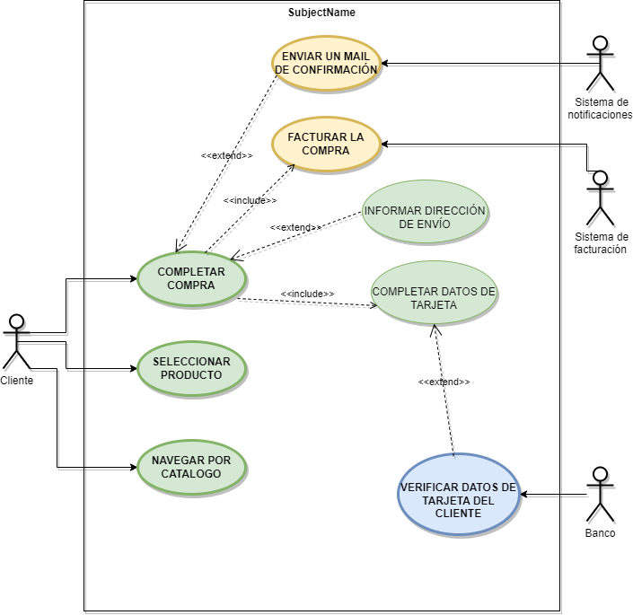

# Ejercicio Simulacro I.

## Ejercicio 1 Tienda de Comercio Elecrónico.

### Una tienda en línea necesita un sistema que permita a los clientes comprar productos a través de un sitio web.

Como parte de los requisitos funcionales, el sistema debe incluir los siguientes procesos:

   1. El cliente puede navegar por el catálogo para visualizar los productos disponibles.
   2. Una vez que el cliente selecciona un producto, tiene la opción de colocar el artículo en el carrito.
   3. Para completar la compra, el cliente debe realizar las siguientes acciones:
        - Informar su dirección de envío (extensión opcional si ya tiene una dirección registrada). 
        - Completar los datos de su tarjeta de crédito para el pago. 
   4. Durante la transacción, el sistema debe: 
        - Verificar los datos de la tarjeta de crédito del cliente. 
        - Facturar la compra exitosamente. 
        - Enviar un e-mail de confirmación con los detalles de la compra al cliente.

El sistema también debe mostrar qué partes de este flujo son obligatorias y cuáles son opcionales. A partir de los requerimientos indicados:

Diseña un diagrama de casos de uso que represente las interacciones entre el cliente, el sistema y los casos de uso necesariosy los actores implicados para realizar una compra. Usa relaciones como `<<include>>` y `<<extend>>` según corresponda.
 
 
 
"

---

## Ejercicio 2 

### REaliza la especificación de casos de uso de la siguiente imagen.

 
 
 

---

## Especificación de caso de uso de videoclub.

### Actores.

#### Cliente.

|  Actor | Cliente |
|---|---|
| Descripción  | Usuario común del videoclub.  |
| Características  |  |
| Relaciones | - Registrar un alquiler o una reserva de alquiler  |
| Referencias |- Proporciona sus datos personales  - Reservar una película    - Alquilar una película   - Seleccionar una película.|   
|  Notas |   |
| Autor  | Carlos Antonio Díaz Galán |
|Fecha | 19/11/2024 |

|  Atributo |||
|---|---|---|
| _Nombre_  | _Descripción_  | _Tipo_ |
| | |

#### Proveedor.

|  Actor | Proveedor |
|---|---|
| Descripción  | Proveedor de películas.  |
| Características  | El proveedor provee de películas. |
| Relaciones | Abastece a los videoclubs. |
| Referencias | - Abastece películas según existencias. |   
|  Notas |   |
| Autor  | Carlos Antonio Díaz Galán |
|Fecha | 19/11/2024 |

|  Atributo |||
|---|---|---|
| _Nombre_  | _Descripción_  | _Tipo_ |
| | |

#### Administrador del videomax.

|  Actor | Administrador. |
|---|---|
| Descripción  | Notificación de la biblioteca.  |
| Características  | Las mismas funciones que el cliente y sus acciones específicas. |
| Relaciones | - Registra.   - Actualiza. |
| Referencias | - Registra los datos del cliente.   - Registra el alquiler de películas.   - Registra la reserva de peículas.   - Registra las películas que llegan nuevas.    - Actualiza el proveedor. |   
|  Notas |   |
| Autor  | Carlos Antonio Díaz Galán |
|Fecha | 19/11/2024 |

|  Atributo |||
|---|---|---|
| _Nombre_  | _Descripción_  | _Tipo_ |
| | |

### Casos de uso.

#### Proporcionar datos personales.

|  Caso de Uso	CU.1 | Proporcionar datos personales.  |
  |---|---|
  | Fuentes  | Este caso de uso se sustenta gracias al [documento]()  |
  | Actor  |  Cliente. |
  | Descripción | Proporciona datos personales para poder alquilar películas.  |
  | Flujo básico |1. El cliente entrega sus credenciales y datos.  2. El cliente firma el contrato. |
  | Pre-condiciones | El cliente tiene que disponer de documentos para proporcionar sus datos personales.  |  
  | Post-condiciones  | Aceptar las condiciones en la política del videoclub.  |  
  |  Requerimientos | Datos personales.  |
  |  Notas |  _Notas adicionales_ |
  | Autor  | Carlos Antonio Díaz Galán |
  |Fecha | 19/11/2024 |

#### Alquilar una película

| Caso de Uso CU.2 | Registrar un alquiler            |
|------------------|----------------------------------|
| Fuentes          | Este caso de uso se sustenta gracias al [documento](). |
| Actor            | Cliente, administrador.           |
| Descripción      | Permite registrar un alquiler de una o varias películas solicitada por el cliente. |
| Flujo básico     | 1. El administrador selecciona la película solicitada por el cliente. 2. Se verifica la disponibilidad de la película. 3. Se registra el alquiler y se actualiza el estado dela película. 4. El sistema genera una fecha de devolución. |
| Pre-condiciones  | El usuario debe tener una cuenta activa y la película debe estar disponible. |
| Post-condiciones | La película queda registrada como alquilada y la fecha de devolución se establece. |
| Requerimientos   | Sistema de registro de alquileres y disponibilidad de la película. |
| Notas            |                          |
| Autor            | Carlos Antonio Díaz Galán |
| Fecha            | 19/11/2024               |

#### Reservar película

| Caso de Uso CU.3 | Reservar película              |
|------------------|-----------------------------------|
| Fuentes          | Este caso de uso se sustenta gracias al [documento](). |
| Actor            | Cliente, administrador.           |
| Descripción      | Permite realizar una reserva de un próximo título o uno que esté reservado. |
| Flujo básico     | 1. El administrador revisa los alquileres activos. 2. Se identifican los alquileres próximos a vencer. 3. Se genera una reserva con los datos del cliente. |
| Pre-condiciones  | Debe haber alquileres activos en el sistema. |
| Post-condiciones | El usuario recibe una fecha con la reserva. |
| Requerimientos   | Contacto del usuario |
| Notas            |                          |
| Autor            | Carlos Antonio Díaz Galán |
| Fecha            | 29/10/2024               |

#### Abastecer películas.

| Caso de Uso CU.4 | Abastecer películas.               |
|------------------|-----------------------------------|
| Fuentes          | Este caso de uso se sustenta gracias al [documento]() |
| Actor            | Proveedor.           |
| Descripción      | El proveedor abastece de títulos según hayan existencias a los videoclubs. |
| Flujo básico     | 1. El administrador solicita uno o varios títulos al proveedor. 2. El proveedor comprueba disponibilidad.  3. Se abastece películas. |
| Pre-condiciones  | Debe haber existencias. |
| Post-condiciones | Se actualiza las películas. |
| Requerimientos   | Contacto entre el videoclub y el proveedor. |
| Notas            |                          |
| Autor            | Carlos Antonio Díaz Galán |
| Fecha            | 19/11/2024               |

#### Registrar cliente.

| Caso de Uso CU.5 | Registrar cliente.               |
|------------------|-----------------------------------|
| Fuentes          | Este caso de uso se sustenta gracias al [documento]() |
| Actor            | Administrador.           |
| Descripción      | El cliente registra y da de alta al cliente. |
| Flujo básico     | 1.El cliente entrega sus datos personales. 2. El Administrador comprueba y hace las gestiones para registrar al cliente.  3. Se realiza el alta en la base de datos de clientes. |
| Pre-condiciones  | El cliente debe disponer de los datos personales en documentos. |
| Post-condiciones | El cliente puede alquilar. |
| Requerimientos   | Documentos personales. |
| Notas            |                          |
| Autor            | Carlos Antonio Díaz Galán |
| Fecha            | 19/11/2024               |

#### Registrar película.

| Caso de Uso CU.6 | Registrar película.               |
|------------------|-----------------------------------|
| Fuentes          | Este caso de uso se sustenta gracias al [documento]() |
| Actor            | Administrador.           |
| Descripción      | El administrador registra los títulos nuevos que le abasteció el proveedor. |
| Flujo básico     | 1.El proveedor entrega los títulos nuevos. 2. El Administrador comprueba y hace las gestiones para registrarlos.  3. Se realiza el alta en la base de datos de películas.  4. Están disponibles para alquilar. |
| Pre-condiciones  | El administrador debe comprobar que no se disponga en el videoclub   El proveedor primero debió abastecer el título a registrar. |
| Post-condiciones | El cliente puede alquilar las películas nuevas. |
| Requerimientos   |  |
| Notas            |                          |
| Autor            | Carlos Antonio Díaz Galán |
| Fecha            | 19/11/2024               |

#### Registrar reserva.

| Caso de Uso CU.7 | Registrar reserva.               |
|------------------|-----------------------------------|
| Fuentes          | Este caso de uso se sustenta gracias al [documento]() |
| Actor            | Administrador.           |
| Descripción      | El administrador registra la reserva de una película que el cliente quiera. |
| Flujo básico     | 1.El cliente solicita una o varias películas que estén alquiladas o pendientes de llegar nuevas. 2. El Administrador comprueba y hace las gestiones para registrar la solicitud.  3. Se realiza la reserva de películas.  4. Se proporciona al cliente el comprobante de reserva con las condiciones. |
| Pre-condiciones  | Se debe comprobar que no se disponga en el videoclub   |
| Post-condiciones | El cliente puede alquilar las películas nuevas o alquiladas. |
| Requerimientos   |  |
| Notas            |                          |
| Autor            | Carlos Antonio Díaz Galán |
| Fecha            | 19/11/2024               |

#### Registrar alquiler.

| Caso de Uso CU.8 | Registrar alquiler.               |
|------------------|-----------------------------------|
| Fuentes          | Este caso de uso se sustenta gracias al [documento]() |
| Actor            | Administrador.           |
| Descripción      | El administrador registra el alquiler de una película que el cliente quiera. |
| Flujo básico     | 1.El cliente solicita una o varias películas que quiera alquilar. 2. El Administrador comprueba y hace las gestiones para registrar la solicitud.  3. Se realiza el alquiler de películas.  4. Se proporciona al cliente el comprobante del alquiler con las condiciones. |
| Pre-condiciones  | El título debe estar disponible en el videoclub.   |
| Post-condiciones | El cliente se compromete a devolver la película. |
| Requerimientos   |  |
| Notas            |                          |
| Autor            | Carlos Antonio Díaz Galán |
| Fecha            | 19/11/2024               |

#### Registrar cliente.

| Caso de Uso CU.8 | Registrar cliente.               |
|------------------|-----------------------------------|
| Fuentes          | Este caso de uso se sustenta gracias al [documento]() |
| Actor            | Administrador.           |
| Descripción      | El administrador registra al cliente en la base de datos del videoclub. |
| Flujo básico     | 1.El cliente entrega los documentos que se le solicitan. 2. El Administrador comprueba y hace las gestiones para registrar al cliente.  3. Se da de alta al cliente con las condiciones de la política del videoclub.  4. Se proporciona al cliente el comprobante del registro con las condiciones. |
| Pre-condiciones  | El cliente solicita el registro.  |
| Post-condiciones | El cliente se compromete a devolver la película. |
| Requerimientos   |  |
| Notas            |                          |
| Autor            | Carlos Antonio Díaz Galán |
| Fecha            | 19/11/2024               |